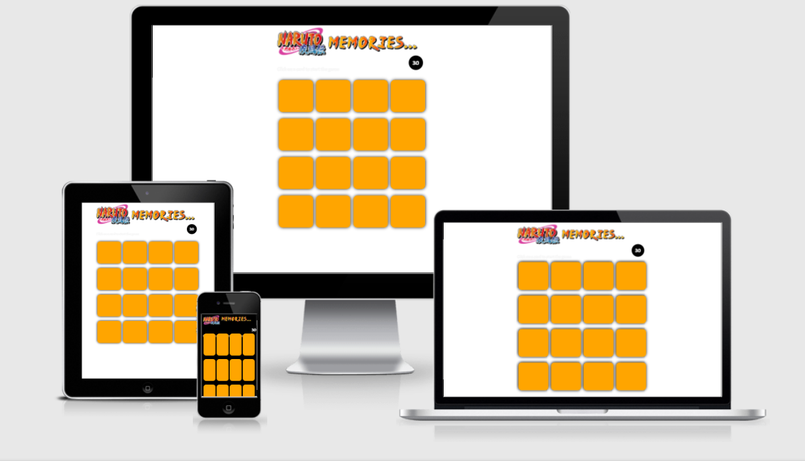

<h1 align="center">Naruto Memories</h1>

[View the live project here.](https://maziz-0.github.io/Naruto-Memories/)

This is the main marketing website for Code Institute. It is designed to be responsibe and accessible on a range of devices, making it easy to navigate for potential students and partners.

<h2 align="center"></h2>


## How to Play
1. Click on any card to reveal all the cards, memorise quickly before they flip back.
2. Click on any card to start the timer.
3. Use your memory to remember what images show up on which card. You have 30 seconds to match all the cards
4. You win the game when all 16 cards are matched!

### Project Specifications

| CRITERIA | MEETS SPECIFICATIONS
|---|:---
| Splash Screen | Player is greeted with a splash screen introducting the story behind the game. How to play is on the splash screen.
| Memory Game Logic | The game randomly shuffles the cards. A user wins once all cards have successfully been matched.
| Victory Popup | When a user wins the game, a custom Sweet Alert appears to congratulate the player and asks if they want try again or learn about the developer. 
| Loss Popup | When a user loses the game, a custom Sweet Alert appears to further the story line set out from the splash screen and also asks if they want to play again or learn about the developer. 
| Timer | When the player starts a game, a timer should also start. Once the player wins the game, the timer stops.
| Double click | User is able to double click a card to return its original position.

## User Experience (UX)

-   ### User stories

    -   #### First Time Visitor Goals

        1. As a First Time Visitor, I want to be pulled in by the theme of the website/game.
        2. As a First Time Visitor, I want to be able to play the game as intended for it to function.
        3. As a First Time Visitor, I want to learn more about the developer.

    -   #### Returning Visitor Goals

        1. As a Returning Visitor, I want to see if if the game is fun being replayed.
        2. As a Returning Visitor, I want to find the best way to get find out more about the developer.
        

    -   #### Frequent User Goals
        1. As a Frequent User, I want to check to see if there are any newly added challenges or updates.
        2. As a Frequent User, I want to check to see if theres any new features.
        3. As a Frequent User, I want to always have fun playing the game, the replayabiltiy is what I am looking for.

-   ### Design
    -   #### Colour Scheme
        -   The two main colours used represent the main character's (Naruto) color scheme which is orange, and black.
    -   #### Typography
        -   The Acme font is the main font used throughout the whole website with Sans Serif as the fallback font. Acme is a stylistic font used to achieve a vintage flash game look, so it is both attractive and appropriate.
    -   #### Imagery
        -   Imagery is vital. The large, background hero image is designed to be a striking centerpiece as if the user is in midst of the battle. It also has a minimalist color scheme which does not clash with the Orange/Black palette.

*   ### Wireframes

    -  Wireframe - [View](https://user-images.githubusercontent.com/41737293/115411820-b91cf000-a1eb-11eb-8c64-47ec6c2f3150.png)

   
## Features

-   Responsive on all device sizes

-   Interactive elements

## Technologies Used

### Languages Used

-   [HTML5](https://en.wikipedia.org/wiki/HTML5)
-   [CSS3](https://en.wikipedia.org/wiki/Cascading_Style_Sheets)
-   [Javascript](https://en.wikipedia.org/wiki/JavaScript)

### Frameworks, Libraries & Programs Used


1. [Google Fonts:](https://fonts.google.com/)
    - Google fonts were used to import the 'Titillium Web' font into the style.css file which is used on all pages throughout the project.
1. [jQuery:](https://jquery.com/)
    - jQuery was used for the card game logic.
1. [SweetAlert2](https://sweetalert2.github.io/)
    -  SweetAlert2 was used to create the Victory and Loss alerts.
1. [Git](https://git-scm.com/)
    - Git was used for version control by utilizing the Gitpod terminal to commit to Git and Push to GitHub.
1. [GitHub:](https://github.com/)
    - GitHub is used to store the projects code after being pushed from Git.
1. [Photoshop:](https://www.adobe.com/ie/products/photoshop.html)
    - Photoshop was used to edit the background hero image.
1. [Balsamiq:](https://balsamiq.com/)
    - Balsamiq was used to create the [wireframes](https://github.com/) during the design process.

## Testing

The W3C Markup Validator and W3C CSS Validator Services were used to validate every page of the project to ensure there were no syntax errors in the project.

-   [W3C Markup Validator](https://jigsaw.w3.org/css-validator/#validate_by_input) - [Results](https://user-images.githubusercontent.com/41737293/115413470-1bc2bb80-a1ed-11eb-961f-a024e333d2c4.PNG)
-   [W3C CSS Validator](https://jigsaw.w3.org/css-validator/#validate_by_input) - [Results](https://user-images.githubusercontent.com/41737293/115413571-31d07c00-a1ed-11eb-8a3c-d53d654d40d8.PNG)

### Testing User Stories from User Experience (UX) Section

-   #### First Time Visitor Goals

    1. As a First Time Visitor, I want to be pulled in by the theme of the website/game.

        1. Upon entering the site, users are automatically greeted with a clean and easily readable Splash screen which introduces the plot and premise for the game. There is a Hero Image used in the background which displays the enemy opponent(Itachi).
        2. There is a brief tutorial text which tells the user how to play, not much detail is needed as the game is intuitive enough to pick up without instructions.
        3. The splash screen has an appropriate timeout feature which gave me enough time to read the content and tutorial.

    2. As a First Time Visitor, I want to be able to play the game as intended for it to function.

        1. Each component of the website is clear and structered, seperated by a splash screen, the main game and finally a victory or loss alert.
        2. The timeout features is functional, the cards flips are fluid and the timer is working correctly.
        3. There is an option to "Play again" when winning and "Try again" when losing, GIFs are also used to give more emphasis to the win/loss.

    3. As a First Time Visitor, I want to learn more about the developer.

        1. Once the new visitor has won the game or lost the game there is a link to the developer's portfolio.
        2. Developer links are not as crucial and should not take away from the experience, therefore they are only used once the game session has ended.
        

-   #### Returning Visitor Goals

    1. As a Returning Visitor, I want to see if if the game is fun being replayed.

        1. The cards are randomised so each experience is different.
        2. The use of a 30 second timer makes the game fast and exhilirating which allows for replayability.
        3. A suggestion is made at the end of the game to give more reasons for the player to challenge themself.

    2. As a Returning Visitor, I want to find the best way to get find out more about the developer.

        1. A link is readily available whether the game is won or lost.
        2. Portfolio give a base introduction and provides information on the developers skillset and links to all socials.


-   #### Frequent User Goals

    1. As a Frequent User, I want to check to see if there are any newly added challenges or updates.

        1. The user can continue to play in the conventional way or without memorising.

    2. As a Frequent User, I want to check to see if theres any new features.

        1. The user would already be comfortable with the game but has access to the developer through the portfolio to see if they make any more updates or features.

    3. As a Frequent User, I want to always have fun playing the game, the replayabiltiy is what I am looking for.

        1. The memory game is fluid and works well, with a small timer which makes the game difficult if you aren't familiar with the images used as they are not simplified symbols.
        2. There is an option to play the matching game without memorising the cards which can make the game more intense and harder to win.
    

### Further Testing

-   The Website was tested on Google Chrome, Internet Explorer, Microsoft Edge and Safari browsers.
-   The website was viewed on a variety of devices such as Desktop, Laptop, iPhone7, iPhone 8 & iPhoneX.
-   A large amount of testing was done to ensure that all pages were linking correctly.
-   Friends and family members were asked to review the site and documentation to point out any bugs and/or user experience issues.

### Known Bugs

-   On some mobile devices the Hero Image pushes the size of screen out more than any of the other content on the page.
    -   A white gap can be seen to the right of the footer and navigation bar as a result.
-   On Microsoft Edge and Internet Explorer Browsers, all links in Navbar are pushed upwards when hovering over them.

## Deployment

### GitHub Pages

The project was deployed to GitHub Pages using the following steps...

1. Log in to GitHub and locate the [GitHub Repository](https://github.com/)
2. At the top of the Repository (not top of page), locate the "Settings" Button on the menu.
    - Alternatively Click [Here](https://raw.githubusercontent.com/) for a GIF demonstrating the process starting from Step 2.
3. Scroll down the Settings page until you locate the "GitHub Pages" Section.
4. Under "Source", click the dropdown called "None" and select "Master Branch".
5. The page will automatically refresh.
6. Scroll back down through the page to locate the now published site [link](https://github.com) in the "GitHub Pages" section.

### Forking the GitHub Repository

By forking the GitHub Repository we make a copy of the original repository on our GitHub account to view and/or make changes without affecting the original repository by using the following steps...

1. Log in to GitHub and locate the [GitHub Repository](https://github.com/)
2. At the top of the Repository (not top of page) just above the "Settings" Button on the menu, locate the "Fork" Button.
3. You should now have a copy of the original repository in your GitHub account.

### Making a Local Clone

1. Log in to GitHub and locate the [GitHub Repository](https://github.com/)
2. Under the repository name, click "Clone or download".
3. To clone the repository using HTTPS, under "Clone with HTTPS", copy the link.
4. Open Git Bash
5. Change the current working directory to the location where you want the cloned directory to be made.
6. Type `git clone`, and then paste the URL you copied in Step 3.

```
$ git clone https://github.com/YOUR-USERNAME/YOUR-REPOSITORY
```

7. Press Enter. Your local clone will be created.

```
$ git clone https://github.com/YOUR-USERNAME/YOUR-REPOSITORY
> Cloning into `CI-Clone`...
> remote: Counting objects: 10, done.
> remote: Compressing objects: 100% (8/8), done.
> remove: Total 10 (delta 1), reused 10 (delta 1)
> Unpacking objects: 100% (10/10), done.
```

Click [Here](https://help.github.com/en/github/creating-cloning-and-archiving-repositories/cloning-a-repository#cloning-a-repository-to-github-desktop) to retrieve pictures for some of the buttons and more detailed explanations of the above process.

## Credits

### Code

-   The full-screen hero image code came from this [StackOverflow post](https://stackoverflow.com)

-   [Bootstrap4](https://getbootstrap.com/docs/4.4/getting-started/introduction/): Bootstrap Library used throughout the project mainly to make site responsive using the Bootstrap Grid System.

-   [MDN Web Docs](https://developer.mozilla.org/) : For Pattern Validation code. Code was modified to better fit my needs and to match an Irish phone number layout to ensure correct validation. Tutorial Found [Here](https://developer.mozilla.org/en-US/docs/Web/HTML/Element/input/tel#Pattern_validation)

### Content

-   All content was written by the developer.

-   Psychological properties of colours text in the README.md was found [here](http://www.colour-affects.co.uk/psychological-properties-of-colours)

### Media

-   All Images were created by the developer.

### Acknowledgements

-   My Mentor for continuous helpful feedback.

-   Tutor support at Code Institute for their support.